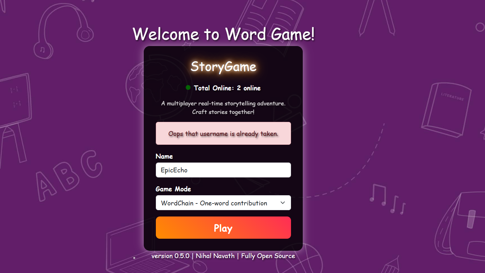
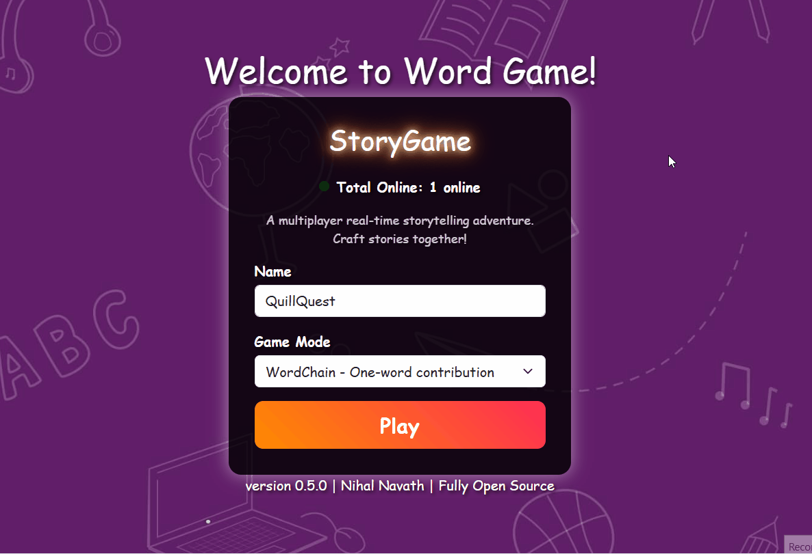

## [skip to installation](#installing)

(This was made for a 24 hour game jam.)
# About - Word Game

The collaborative game is based on a real life game often called as "one word" game. It consists of a group of members (4-10 preferably) where each member gets to add exactly one word to the narrative. after a while a whole story is created!

There should be a minimum of two players, for demonstration you can open in another tab and join as another user.

Rules:-
1) One Word Per Turn – Each player can say only one word (unless a different game mode is selected).
2) Time Limit (30 Seconds) – If a player doesn’t respond within 30 seconds, their turn will be skipped automatically.

## Tech Stack

### Real-Time Communication
- **WebSockets (Socket.io)** – Enables seamless real-time collaboration.

### Languages
- **TypeScript** – Ensures type safety and scalability.
- **HTML, CSS** – Used for structuring and styling the user interface.

### Backend
- **Node.js** – Handles server-side logic and content delivery.
- **Express.js** – Lightweight framework for serving content and API endpoints.

## Features
- Multiplayer application with live updates using websockets.
- User-friendly interface with real-time updates.
- game audio to enhance experience
- Scalable backend for smooth performance.
- auto choose name
- auto word recommendations
- username logic (prevent duplicates, illegal names)
- auto connect/disconnection handler logic
- \+ and much more!
---

# Installing

Installing is as simple as running

```bash
$ git clone https://github.com/NihalNavath/word-game-jam
```

then run this in the cloned directory to install the dependencies

```bash
$ npm install OR pnpm install
```

then run the following command to run the application

```bash
$ npm start
```

--- 

## Screenshots

Login Page

<br> Running

<br> Live Online Count
